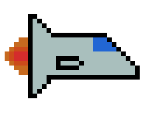

# SpaceShipGame
 
## Table of contents
* [General info](#general-info)
* [Technologies](#technologies)
* [Setup](#setup)
* [Sources](#sources)

## General info
My first project, Mini Spaceship game created in PyGame.
Use ↑↓ to play, Space key to start and Esc to close the game.

## Technologies
Project is created with:
* Python 3.7
* Piskel-0.14.0
* JetBrains PyCharm Community Edition 2019

## Setup
To run this project, install locally:

```
$ Python #.x Install
$ pygame install
$ pip install
$ os install
$ random install
$ math install 
Clone the repository:
$ git https://github.com/Nstrzelczyk/SpaceShipGame

```

## Sources
This app is inspired by "Python, kurs programowania na prostych przykładach", Komputer Świat.
